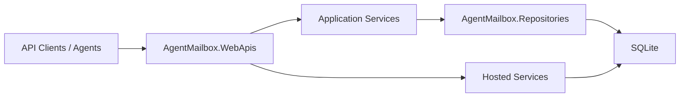

# 项目总览

本文档说明 `AgentMailbox` 仓库的整体结构、模块职责与运行关系。

## 项目定位

项目用于为 AI Agent 提供统一的邮件基础能力，当前版本聚焦：

- Agent 邮箱管理
- 邮件列表与详情查询
- 线程上下文查询
- 新邮件发送与回复请求入队
- 入站监听与出站分发后台能力骨架

## 分层结构

### `AgentMailbox.WebApis`

- ASP.NET 10 Web 应用入口
- 提供 `/api/mailboxes`、`/api/messages`、`/api/threads` 与 `/health`
- 负责配置绑定、依赖注入、后台任务宿主与应用服务组合

### `AgentMailbox.Repositories`

- SQLite 仓储层
- 使用 `Dapper` 与 `Microsoft.Data.Sqlite`
- 使用 `FluentMigrator` 管理 SQLite schema
- 负责邮箱、邮件、线程和出站任务的最小持久化

### `AgentMailbox.Core`

- 对外契约 DTO
- 内部领域模型与状态枚举
- 配置类型

### `dbscripts`

- 历史脚本与参考说明

## 运行关系

## 当前关键设计

- 对外 HTTP API 返回明确 DTO，不直接暴露仓储记录模型。
- 发送请求会先落库为邮件记录与待发送任务，再由后台分发器异步处理。
- 入站监听和出站分发默认禁用，保证框架起步阶段安全可运行。
- SQLite schema 在应用启动时通过 `FluentMigrator` 自动升级。
